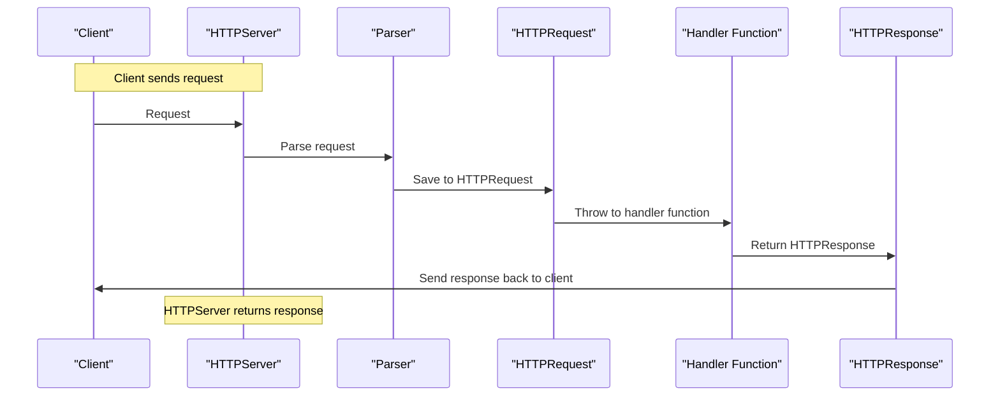

# Day 6 - April 24, 2025

> Okay, let's plan first. 

Here is the [mermaid](https://mermaid.liveedit.me/) diagram of the process:

So, it is much clear right now that we messed up HTTPServer and HTTPRequest stages previously. Right now we have to fix this first.

1. Define `HTTPRequest` struct
2. Refactor `HTTPServer` struct
3. Refactor `parse_http_request()`
4. Add memory safety best-practices:
    - centralized alloc-dealloc
    - signal handlers and standard error message codes

So, we know our next steps, let's start. [00:59]

