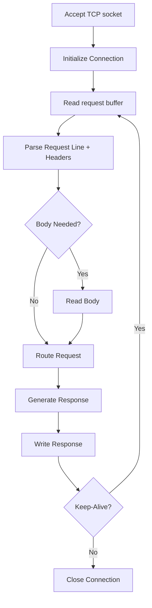

```mermaid
graph TD
A[Accept TCP socket] --> B[Initialize Connection]
B --> C[Read request buffer]
C --> D[Parse Request Line + Headers]
D --> E{Body Needed?}
E -- No --> F[Route Request]
E -- Yes --> G[Read Body]
G --> F
F --> H[Generate Response]
H --> I[Write Response]
I --> J{Keep-Alive?}
J -- Yes --> C
J -- No --> K[Close Connection]
```